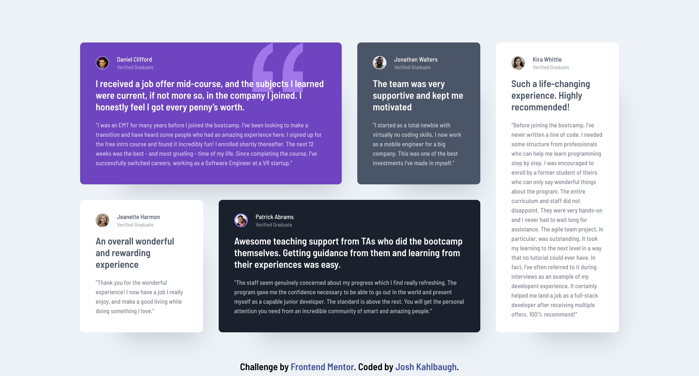

# Frontend Mentor - Testimonials grid section solution

This is a solution to the [Testimonials grid section challenge on Frontend Mentor](https://www.frontendmentor.io/challenges/testimonials-grid-section-Nnw6J7Un7). Frontend Mentor challenges help you improve your coding skills by building realistic projects. 

## Table of contents

- [Overview](#overview)
  - [The challenge](#the-challenge)
  - [Screenshot](#screenshot)
  - [Links](#links)
- [My process](#my-process)
  - [Built with](#built-with)
  - [What I learned](#what-i-learned)
  - [Continued development](#continued-development)
  - [Useful resources](#useful-resources)
- [Author](#author)

## Overview

### The challenge

Users should be able to:

- View the optimal layout for the site depending on their device's screen size

### Screenshot



### Links

- Solution URL: [Solution URl](https://github.com/Joshk7/testimonials-grid)
- Live Site URL: [Live Site URL](https://testimonials-grid-dusky-eight.vercel.app/)

## My process

This challenge allowed me to practice my CSS grid skills. First, I created the mobile version and then set display to grid for the main container. The rest of the challenge really depended on setting the right breakpoint for multiple grid layouts to take place as well as specifying the correct grid rows and columns.

### Built with

- Semantic HTML5 markup
- CSS custom properties
- Flexbox
- CSS Grid
- Mobile-first workflow

### What I learned

I learned how to setup CSS grid templates as well as when to set a breakpoint for layouts to take effect. The final layout for the cover of this project ended up being less css than I initially thought.

```css
@media screen and (min-width: 1100px) {
    .card-container {
        grid-template-columns: repeat(4, 1fr);
    }

    .one {
        grid-column: span 2;
    }

    .three {
        grid-column: 1;
    }

    .four {
        grid-column: span 2;
    }

    .five {
        grid-row: 1 / 3;
        grid-column: 4;
    }
}
```

I also looked at setting grid-template-areas, but I already set it up with grid-template-columns first, so that's what I stuck with.

### Continued development

If I really wanted to continue working on this project, I could try switching the main grid template to use grid areas instead of grid template columns.

### Useful resources

- [An Interactive Guide to CSS Grid](https://www.joshwcomeau.com/css/interactive-guide-to-grid/) - This helped me initially understand CSS grid.

## Author

- Website - [Josh Kahlbaugh](https://www.your-site.com)
- Frontend Mentor - [@Joshk7](https://www.frontendmentor.io/profile/Joshk7)